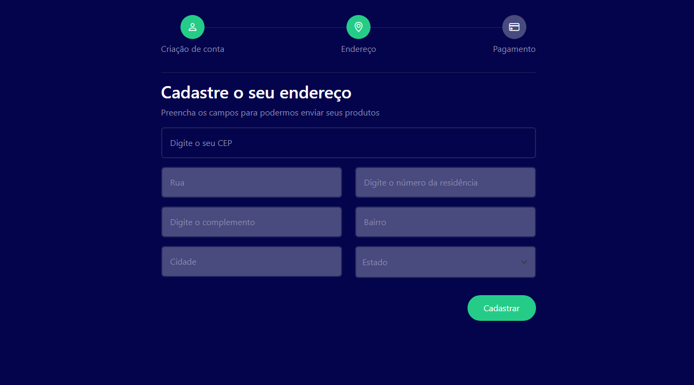

<h1 align="center">Validado de cep 🚚</h1>

    

    

   Validado de cep. Que simula um cadastro de pagamento em etapas para um visual mais atraente.  
   O objetico desse projeto foi praticar tecnlogias front-end e consumo de api via cep, para fazer  
   requisições de dados e organizalos de volta para o usuário no formulario, e se caso o cep for falso  
   o programa retorna a mensssagem de erro limpando o formulario, para o usuário tentar novamente, fique  
   a vontade para testalo no link a baixo.

<h2 align="center">Tecnologias usadas.</h2>   

 
  
    
  
    

  

<a target="_blank" href="https://guidev1.github.io/validadoDeCep/">🌍 Visualizar página</a>
